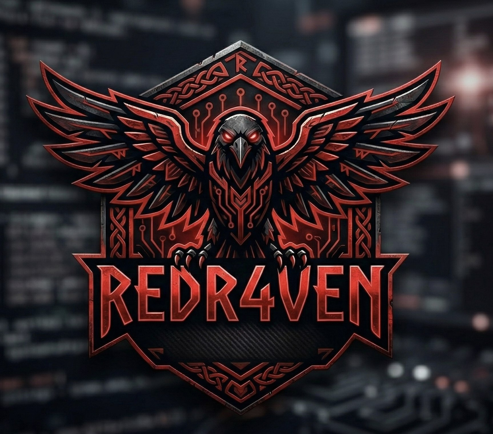

<h1 align="center">Hi there, I'm Alejandro Herreros aka redr4ven</h1>

<h3 align="center">Big Data | Machine Learning | Cybersecurity</h3>

  

  
  
  

---

### About Me

I’m an undergraduate student in **Computer Engineering** with a strong foundation in programming languages and data systems.

My current focus is on:
- Building scalable systems with **Big Data technologies** (**Apache Spark**, **Cloudera**).
- Designing intelligent solutions using **PyTorch** and **TensorFlow**.
- Exploring secure computing, **cryptography**, and **cybersecurity** research.

Comfortable working with:
- Linux-based distros (esp. **Kali Linux**)
- Terminal workflows with **zsh**, **fish**, and **Neovim**

---

### 🚩 Offensive Security & Adversarial Research

I focus on the technical intersection of **Big Data Analytics** and **Offensive Security**, leveraging automated data processing to identify attack surfaces.

* **Vulnerability Research:** Analyzing software binaries and web architectures for common OWASP Top 10 vulnerabilities and logic flaws.
* **Post-Exploitation:** Developing custom payloads for **Lateral Movement** and maintaining persistence in Unix-based environments.
* **Infrastructure:** Hardening and auditing distributed systems (Hadoop/Spark clusters) against unauthorized access.
* **CTF Focus:** Active in **pwn**, **crypto**, and **web** categories.

---

### Featured Security Engagements (RootedCON 2026)

I am actively involved in the Spanish cybersecurity scene, specifically focusing on hardware exploitation and complex CTF environments.

* **Hardware Hacking CTF – Official RootedCON Badge:**
    * Performed technical analysis and vulnerability exploitation on the official RootedCON hardware.
    * Executed **Reverse Engineering** on the **SoC ESP32-WROOM-32E**, firmware extraction and interface analysis (**UART/JTAG**).

---

### Languages, Tools & Technologies

  
  
  
  
  
  
  
  
  
  
  
  
  
  
  
  
  
  
  

  

  
  
  
  

---

### Stats

  
   
  
   
  

---

### Connect with Me

---
### Tags

  
  
  
  

