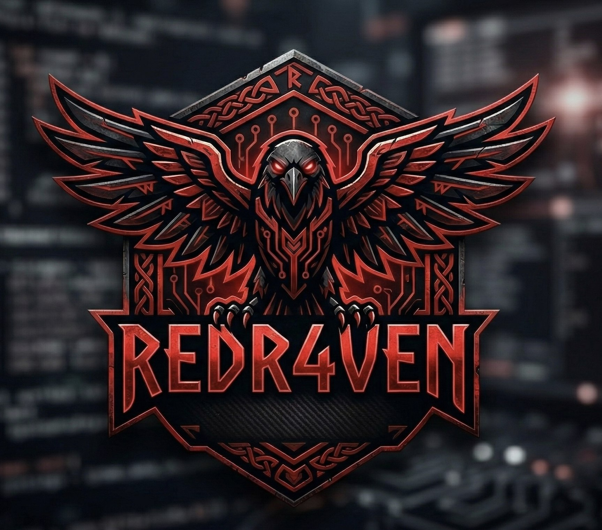

  

<h3 align="center">Big Data | Machine Learning | Cybersecurity</h3>

  

  
  
  

---

### Languages, Tools & Technologies

  
  
  
  
  
  
  
  
  
  
  
  
  
  
  
  
  
  
  

  
  
  
  

---

### About Me

Computer Engineer bridging data-driven architectures and offensive security.

* **Professional Focus:** Machine Learning & Data Science. Scalable analytical systems (Apache Spark) and intelligent solutions (PyTorch, TensorFlow).
* **Independent Research:** Cybersecurity. Vulnerability analysis, low-level exploitation, cryptography, and competitive CTFs.
* **Environment:** Linux (BlackArch, Kali Linux), CLI workflows (zsh, tmux, Neovim).

---

### Offensive Security & Adversarial Research

Focusing on the technical intersection of Big Data Analytics and Offensive Security, leveraging automated data processing to identify attack surfaces.

* **Vulnerability Research:** Binary analysis and web architecture auditing.
* **Post-Exploitation:** Custom payload development for lateral movement and persistence in Unix environments.
* **Infrastructure Auditing:** Hardening distributed systems (Hadoop/Spark clusters).
* **CTF:** Active competitor in pwn, crypto, and web categories.

---

### Featured Security Engagements

* **Hardware Hacking CTF (RootedCON 2026):**
  * Reverse engineering and vulnerability exploitation on the official PACMAN badge.
  * Firmware extraction and interface analysis (UART/JTAG) on the SoC ESP32-WROOM-32E.
* **Var Group Iberia & Yarix CTF:**
  * Ranked 13th overall out of ~250 participants.
  * Applied Purple Team methodology targeting Active Directory (privilege escalation, lateral movement), Web Security, and AI vulnerabilities.

---

### Stats

---

### Connect

